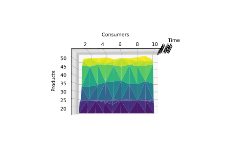

# Filip Kadúch - parallel programming and distributed systems: Documentation

## Assignment 3

#### Python version:
  3.8
#### Modules:
  - import matplotlib.pyplot as plt
  - from random import randint
  - from time import sleep
  - import numpy as np
  - from fei.ppds import Mutex, Semaphore, Thread

#### Tasks:
  1. In the case of P-C, choose one of the criteria of the optimization task (number of products produced per unit of time or number of processed products per unit of time). Develop and thoroughly document an experiment optimization parameter for your system. 
  
#### Classes:
##### 1. Shared
  Class representation of shared object between threads in producer/consumer phase. Initialization requires integer value N to declare storage limit
  ###### Attributes:
        finished - Boolean value representing end of the proccess
        mutex - Mutex object doing the synchronization between threads
        free - Semaphore representation of free space in our "storage" starting on N
        items - Semaphore representation of occupied space in our "storage" starting on 0
        counter - number counter starting from 0 which represents
        save_item - method that represents incrementation of number of saved items in object
        
#### Methods: 
##### 1. producer(Shared, production_time)
  - first part of our synchronization pattern - Producer, starts with simulation of production in duration of production_time, then moves
  to a control segment of free space which awaits signal about current free space from Consumer. After that we are locking our code in order to perform safe way of manipulation with   product in storage in form of call to method save_item of Shared  object. We unlock the code and let the items semaphore know that the storage count is incremented. At the end we     are checking global finished state of the process. Producer gets blocked when the storage (free) is full
  
##### 2. consumer(Shared)
  - Second part of our synchronization pattern - Consumer, starts with the control segment of items space which
  awaits signal about current items production from Producer, then moves onto locking our code in order to perform
  safe way of manipulation with product in storage. After that we unlock the code and signal consumption
  to Shared object and simulate the process of product consumption. At the end we perform a check of global finished state
  of the process. Consumer gets blocked when the storage (items) is empty.

#### Actual experiment with the parameter:

Parameter that we are going to watch throughout the process is going to be number of products produced per unit of time. In order to visualize this optimalisation parameter we need to create loop representing our current iteration (time) of production. Then in that moment/iteration we need to watch current consumption which represents how much products we need to produce in that round. For that situation we are going to call for specific number of times the process of production and consumption and count items produced per unit of time/iteration.

#### 1. Production time - (0,4), Consumptions - (1,5), actual iterations of pattern - 4

In our code we can see a specifically placed 2 lines producing this output:
```
MAIN THREAD 0: AWAITING FINISH
MAIN THREAD 0: PROGRAM FINISHED
```
If there is some output between these two lines it means some thread is blocked at this point. In this experiment the start seemed alright but the synchronization got messed up in higher time iterations:
```
MAIN THREAD 3: AWAITING FINISH
P
P
MAIN THREAD 3: PROGRAM FINISHED
```

##### Output:

In the first picture displaying number of products for consumers we can see the drop of range for production with higher consumption.


Second picture tells us about production over time and we can see a clear assumption of the less production time, the more products.


The last picture of first experiment shows consumption over time.


#### 2. Production time - (0,10), Consumptions - (1,11), actual iterations of pattern - 10

##### Output:

In the first picture of second experiment we can see a real sudden drop of range in higher iterations which seems to slow down in the second half and higher iterations.


In the next picture we can see an event where at the beginning the consumptionm is smaller so the producers don't have to produce that much and it actually grows with the consumption. This event wasn't visible in the first experiment output.



The third picture shows again good layout of consumption over time because this isn't really our watched parameter.


